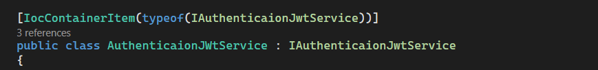
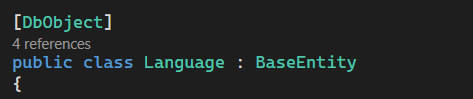
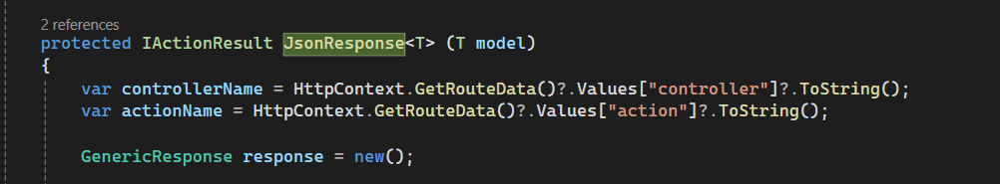

# Asp.net Core 8.0 Project Base

This project is developed as a ready-to-use infrastructure for applications built with Asp.net Core 8.0.

You can rename the project and update the namespaces to suit your requirements.

## Features

- [x] EF-Core
- [x] Generic Repository
- [x] Cache Usage (Redis or Memory Cache Optional)
- [x] Multi-Language Support
- [x] Flexible and dynamic coding-friendly structure
- [x] Dynamic API Logging (log4net)
- [x] Dynamic JSON Response

## Key Highlights

- [x] Easily define IOC Container with the `IocContainerItem` attribute
- 

- [x] Easily add database models with the `DbObject` attribute
- 

- [x] Customize the dynamic response structure to make your project more efficient
-  

- [x] Switch between MemoryCache and Redis via the `appsettings` configuration
